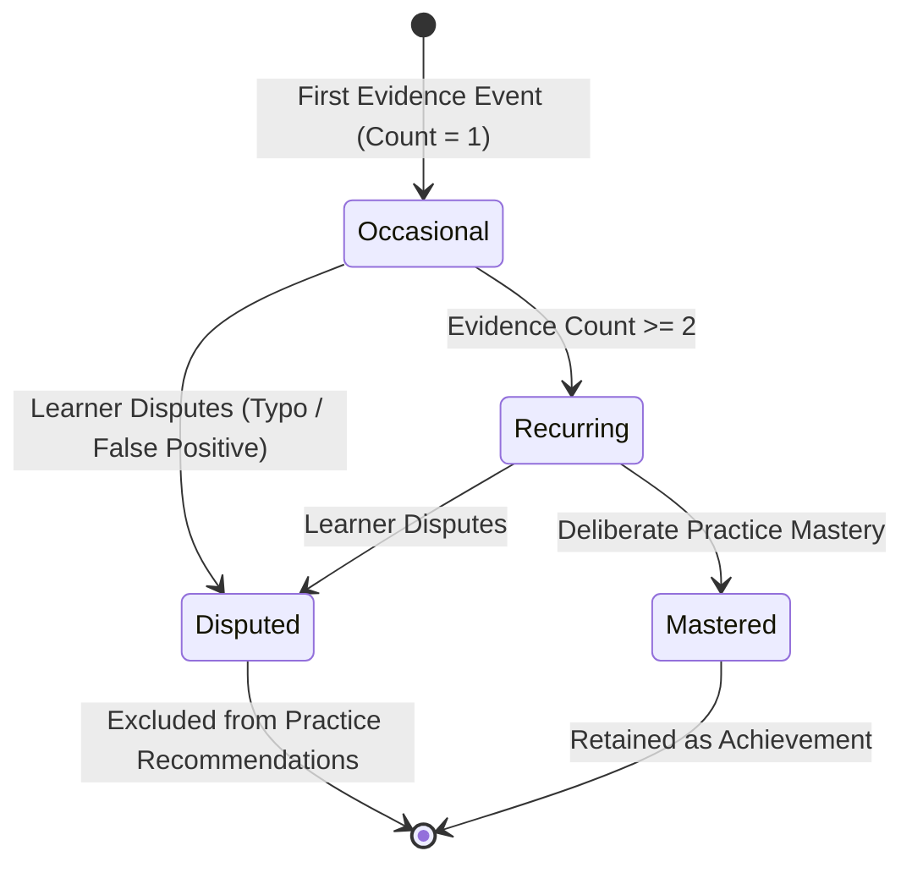

# Endoora AI Mistake Genome & Error Taxonomy Architecture

## 1. Pedagogical Mission & Product Constitution Compliance
The **Endoora AI Mistake Genome** creates a persistent, dynamic diagnostic map of recurring linguistic challenges for Iranian English learners to inform deliberate, personalized practice.

In strict compliance with the **Endoora Product Constitution (Rule #8: Transparent Educational Notices and Constructive Pedagogical Framing)**:
1. **Never Permanent DNA**: A single mistake or momentary slip is never classified as permanent learner identity or recurring incompetence.
2. **Strict Evidence Threshold**: An error pattern requires **at least 2 distinct verified evidence occurrences** before graduating from `occasional` to `recurring`.
3. **Shame-Free Diagnostic Language**: The interface and API descriptions avoid punitive, deficit-focused labels. Errors are analyzed through the lens of positive linguistic transfer and high-leverage growth targets.
4. **Learner Dispute Rights**: Learners can dispute or correct any pattern classification (e.g. distinguishing a fast keyboard typo from a conceptual gap). Disputed patterns are immediately suppressed from recommendation algorithms.
5. **Privacy by Design**: Raw mistake snippets are strictly private to the learner and can be scrubbed while preserving anonymized aggregate counts.

---

## 2. Taxonomy Categories

The taxonomy classifies learner errors into eight structured categories:

| Category Key | Category Name | Description & Common Persian L1 Transfer Manifestation | Example Error Tag |
|---|---|---|---|
| `grammar` | Grammar & Structure | Verb agreement, aspect, conditional clauses, inversion. Persian lacks third-person singular `-s` isolation. | `grammar.third_person_s` |
| `lexical` | Lexical & Vocabulary | False friends, inaccurate semantic breadth, register mismatch. Direct dictionary translation of polysemous words. | `lexical.false_friends` |
| `collocation` | Collocations & Phrasing | Unnatural verb-noun or adjective-noun pairings. Persian uses 'kardan' universally; English distinguishes 'make' vs 'do'. | `collocation.make_vs_do` |
| `spelling` | Spelling & Mechanics | Doubled consonants, silent letters, phonetic spelling influenced by Persian orthography. | `spelling.double_consonants` |
| `discourse` | Discourse & Cohesion | Comma splices, run-ons, lack of concession markers. Persian frequently connects independent clauses with simple commas. | `discourse.comma_splice` |
| `comprehension` | Comprehension & Nuance | Misinterpreting pragmatic implicature, tone, or indirect speech acts. | `comprehension.pragmatic_tone` |
| `pronunciation` | Pronunciation & Stress | Syllable stress shifts across morphologically related words (photograph vs photographer). | `pronunciation.stress_shift` |
| `strategy` | Learning Strategy | Avoidance of relative clauses, over-reliance on high-frequency generic verbs. | `strategy.avoidance_passive` |

---

## 3. Severity & Lifecycle States

### Severity Levels
- **Minor**: Transient slip, keyboard typo, or low-impact phoneme variation that does not impede communication.
- **Moderate**: Noticeable grammatical or lexical flaw that sounds unnatural but remains understandable.
- **Critical**: Structural or lexical breakdown that obscures sentence meaning or violates fundamental CEFR band competencies.

### Pattern Lifecycle

1. **Occasional**: Initial single-event capture. Monitored quietly without triggering intrusive practice mandates.
2. **Recurring**: Promoted once evidence count reaches `2`. Actively surfaced in Daily Mission (`/today`) and AI Exercise Generator (`/practice`).
3. **Disputed**: The learner flags the pattern as an unintended slip or misclassification. Immediately excluded from recommendation feeds.
4. **Mastered**: Successfully resolved through verified exercise completion or teacher review.

---

## 4. Downstream Integration Hooks

1. **Daily Mission Engine (`apps/api/missions/services.py`)**:
   - `build_daily_mission()` inspects `MistakeGenomeService.get_top_practice_targets(user)`.
   - Incorporates top recurring mistake patterns into `evidence_reason["mistake_targets"]` to justify daily practice tasks.
2. **AI Exercise Generator (`apps/api/ai_gateway/services.py`)**:
   - When no custom focus area is provided, queries the highest-priority recurring mistake to guide pedagogical prompts.
   - Automatically feeds incorrect exercise answers back into the Mistake Genome via `record_mistake()`.
3. **Spaced Repetition System (`apps/api/srs/`)**:
   - Vocabulary leeches and recurring collocation traps can be extracted directly into active SRS flashcard candidates with custom editable meanings.
