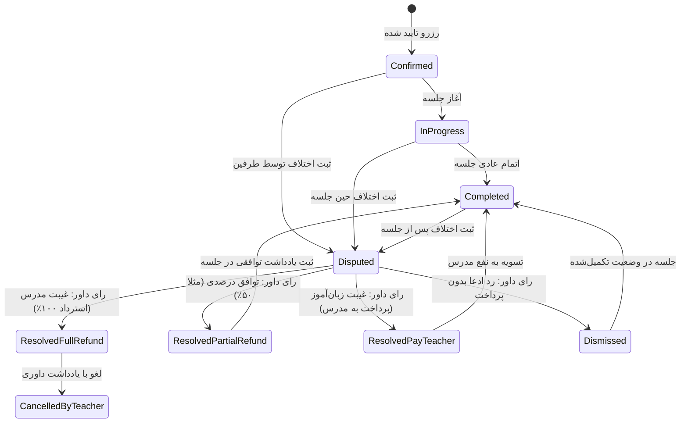
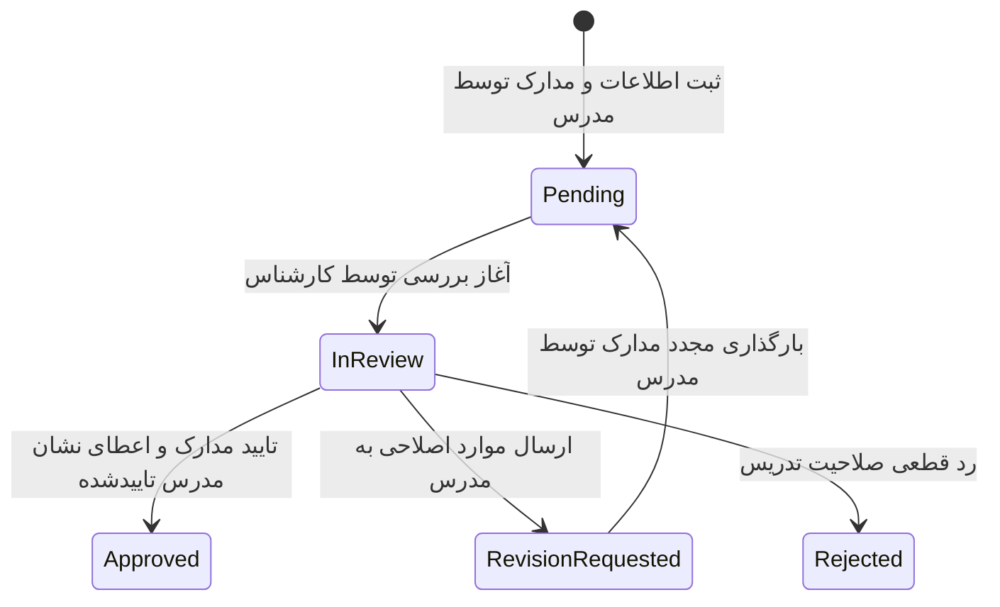

# نظارت مدیریتی بازارگاه، تایید هویت اساتید و حل اختلاف جلسات (MKT-007 / MKT-006)

این سند معماری، مدل‌های داده، قوانین بیزینسی، ماشین وضعیت، سرویس‌ها، اندپوینت‌های امنیتی و رابط‌های کاربری مربوط به **روز ۴۱ از نقشه راه ۶۰ روزه اندورا** را تشریح می‌کند.

---

## ۱. اهداف و چشم‌انداز محصول
بازارگاه آموزش زبان اندورا نیازمند زیرساخت‌های نظارتی، داوری عادلانه، راستی‌آزمایی علمی مدرسین و مدیریت متمرکز سیاست‌های قیمت‌گذاری است:
1. **موتور حل اختلاف و داوری جلسات (Booking Dispute Resolution Engine)**:
   امکان ثبت اعتراض و ادعای اختلاف توسط زبان‌آموز یا مدرس (در مواردی نظیر عدم حضور مدرس، عدم حضور زبان‌آموز، قطعی شدید ارتباط و اینترنت، عدم تطابق سرفصل، رفتار نامناسب یا مغایرت مالی) با قابلیت بررسی کارشناسی، استرداد کامل ۱۰۰٪ وجه، تسویه توافقی درصدی، پرداخت کامل حق‌التدریس به استاد یا رد ادعا.
2. **پایپ‌لاین ارزیابی مدارک و تایید صلاحیت اساتید (Teacher Onboarding Approval Pipeline)**:
   دریافت اطلاعات هویتی و مدارک رسمی مدرسین (کد ملی، تصویر کارت شناسایی، دانشنامه دانشگاهی، مدارک معتبر بین‌المللی نظیر CELTA، TESOL، DELTA یا TTC و لینک نمونه تدریس ویدیویی)؛ همراه با پرتال اختصاصی مدرس و صف ارزیابی کارشناسان اندورا با قابلیت تایید نهایی، درخواست اصلاح مدارک و سوییچ دسترسی بازارگاه (`marketplace_eligible`).
3. **پالایش و نظارت بر بازخوردها و نظرات (Review Moderation & Flagging Triage)**:
   صف نظارت بر بازخوردهای گزارش‌شده یا نیازمند بازبینی ناظر، با قابلیت تایید و انتشار عمومی یا حذف و مستندسازی دلایل نظارتی.
4. **منبع واحد قیمت و پلن‌های پلتفرم (Platform Pricing Plan Source of Truth)**:
   تحقق الزام روز ۰۶ مستندات عمومی با مدل متمرکز `PlatformPricingPlan`؛ مدیریت اشتراک پرمیوم ۹۰ روزه (۴۲۰٬۰۰۰ تومان) با دسترسی عمومی و پنل ویرایش سریع ادمین.

---

## ۲. مدل‌های داده (Django ORM)

### ۲.۱. دسته‌بندی و وضعیت‌های اختلاف (`DisputeReasonCategory`, `DisputeStatus`, `BookingDispute`)
- **دلایل اختلاف (`DisputeReasonCategory`)**:
  - `teacher_absent`: عدم حضور یا تاخیر غیرمجاز مدرس
  - `learner_absent`: عدم حضور زبان‌آموز
  - `technical_difficulties`: قطع ارتباط یا اختلال فنی شدید پلتفرم
  - `poor_quality`: کیفیت نامناسب تدریس یا عدم تسلط علمی
  - `unprofessional_behavior`: رفتار غیرحرفه‌ای یا نقض کدهای اخلاقی
  - `payment_disagreement`: مغایرت در مدت جلسه یا مبلغ
  - `other`: سایر موارد
- **وضعیت‌های پرونده (`DisputeStatus`)**:
  - `open`: باز و در انتظار بررسی
  - `under_review`: در حال ارزیابی کارشناسی
  - `resolved_full_refund`: حل‌شده با بازپرداخت کامل ۱۰۰٪ به زبان‌آموز
  - `resolved_partial_refund`: حل‌شده با تسویه توافقی درصدی
  - `resolved_pay_teacher`: حل‌شده با رد ادعا و پرداخت ۱۰۰٪ به مدرس
  - `dismissed`: رد درخواست داوری
- **مدل `BookingDispute`**:
  - ارتباط یک‌به‌یک با `SessionBooking`
  - `opened_by`: کاربر شاکی (مدرس یا زبان‌آموز)
  - `reason_category`: دسته ادعا
  - `description`: شرح تفصیلی ماجرا
  - `evidence_notes`: مستندات، لینک تست سرعت یا تصاویر
  - `refund_percentage`: درصد استرداد وجه به زبان‌آموز (۰ تا ۱۰۰)
  - `resolution_notes`: گزارش کارشناسی و متن ابلاغ رای
  - `resolved_by`: مدیر یا ناظر صادرکننده حکم داوری
  - `resolved_at`: زمان صدور رای

### ۲.۲. فرآیند تایید صلاحیت مدرس (`TeacherOnboardingStatus`, `TeacherOnboardingApplication`)
- **وضعیت‌ها (`TeacherOnboardingStatus`)**:
  - `pending`: ثبت اولیه و در انتظار نوبت
  - `in_review`: در حال ارزیابی کارشناسی
  - `approved`: تایید شده (اعطای نشان تایید و حضور در بازارگاه)
  - `rejected`: تایید نشده با ذکر دلیل
  - `revision_requested`: نیازمند اصلاح یا بارگذاری مجدد مدارک
- **فیلدهای مدارک**:
  - `national_id_number`: کد ملی ۱۰ رقمی (صرفاً برای احراز هویت داخلی)
  - `id_document_url`: لینک تصویر کارت ملی / شناسنامه
  - `degree_document_url`: لینک دانشنامه دانشگاهی
  - `celta_tesol_document_url`: لینک گواهی دوره‌های بین‌المللی تدریس
  - `sample_teaching_url`: لینک نمونه ویدیویی تدریس (۳ تا ۵ دقیقه)
  - `admin_notes`: یادداشت‌های محرمانه ناظران
  - `rejection_reason`: پیام رسمی علت رد یا اصلاحات برای مدرس

### ۲.۳. پلن قیمت‌گذاری پایه پلتفرم (`PlatformPricingPlan`)
- مدل مرکزی ذخیره‌سازی پلن‌های اشتراک:
  - `code`: شناسه یکتای پلن (مانند `launch_premium_90d`)
  - `name_fa` و `name_en`: عناوین فارسی و انگلیسی
  - `duration_days`: مدت اعتبار به روز (پیش‌فرض ۹۰ روز)
  - `price_toman`: مبلغ به تومان (پیش‌فرض ۴۲۰٬۰۰۰ تومان مطابق لاین‌آپ روز ۰۶)
  - `is_active` و `is_featured`: کنترل انتشار و برجسته‌سازی
  - `features_fa`: آرایه JSON از ویژگی‌ها و دسترسی‌های پلن
  - `note_fa` و `note_en`: یادداشت‌های شفاف‌سازی سیاست قیمت

---

## ۳. ماشین وضعیت و گردش‌کار (State Machine Workflow)

### ۳.۱. چرخه داوری جلسه

### ۳.۲. چرخه تایید صلاحیت مدرس

---

## ۴. اندپوینت‌های REST API

| متد | مسیر URL | سطح دسترسی | شرح عملکرد |
| :--- | :--- | :--- | :--- |
| `GET` | `/api/marketplace/bookings/{id}/dispute/` | شرکت‌کنندگان جلسه یا مدیر | دریافت وضعیت و جزئیات پرونده اختلاف جلسه |
| `POST` | `/api/marketplace/bookings/{id}/dispute/` | شرکت‌کنندگان جلسه | ثبت ادعا و تشکیل پرونده داوری برای جلسه |
| `GET` | `/api/marketplace/admin/disputes/` | فقط مدیران و ناظران | دریافت لیست فیلترپذیر پرونده‌های داوری |
| `GET` | `/api/marketplace/admin/disputes/{id}/` | فقط مدیران و ناظران | دریافت جزئیات تفصیلی و مستندات پرونده |
| `POST` | `/api/marketplace/admin/disputes/{id}/resolve/` | فقط مدیران و ناظران | صدور حکم داوری، درصد استرداد و مختومه کردن پرونده |
| `GET` | `/api/marketplace/teacher/onboarding/` | فقط مدرسین احراز هویت شده | دریافت وضعیت درخواست تایید صلاحیت و مدارک |
| `POST` | `/api/marketplace/teacher/onboarding/` | فقط مدرسین احراز هویت شده | ثبت یا به‌روزرسانی مدارک و ارسال جهت بررسی |
| `GET` | `/api/marketplace/admin/teachers/` | فقط مدیران سیستم | لیست متقاضیان تدریس در صف بررسی |
| `POST` | `/api/marketplace/admin/teachers/{id}/review/` | فقط مدیران سیستم | اعمال نتیجه بررسی (تایید، رد یا درخواست اصلاح) |
| `POST` | `/api/marketplace/admin/teachers/{id}/eligibility/` | فقط مدیران سیستم | فعال یا مسدودسازی دسترسی مدرس به بازارگاه |
| `GET` | `/api/marketplace/admin/reviews/` | فقط مدیران سیستم | لیست بازخوردهای نیازمند نظارت یا گزارش‌شده |
| `POST` | `/api/marketplace/admin/reviews/{id}/moderate/` | فقط مدیران سیستم | تایید و انتشار یا حذف بازخورد |
| `GET` | `/api/marketplace/plans/` | عمومی (AllowAny) | استعلام پلن‌های فعال اشتراک پلتفرم |
| `GET` | `/api/marketplace/admin/plans/` | فقط مدیران سیستم | لیست همه پلن‌های پلتفرم |
| `PATCH` | `/api/marketplace/admin/plans/{id}/` | فقط مدیران سیستم | ویرایش نرخ، وضعیت و مشخصات پلن قیمت‌گذاری |

---

## ۵. رابط کاربری و صفحات فرانت‌اند (Next.js 16)

1. **مرکز عملیات و داوری بازارگاه (`apps/web/app/(admin)/marketplace/page.tsx`)**:
   - دارای ۴ تب تخصصی:
     - داوری و حل اختلاف جلسات (فیلتر وضعیت، مشاهده ادعاها، صدور رای استرداد کامل یا توافقی با توضیحات الزامی).
     - تایید صلاحیت و مدارک اساتید (کد ملی، پیش‌نمایش مدارک، دکمه‌های تایید، اصلاح، رد، و سوییچ دسترسی بازارگاه).
     - نظارت بر بازخوردهای گزارش‌شده (امتیاز تفکیکی، متن نظر، حذف یا تایید و انتشار).
     - تنظیم پلن‌های اشتراک و قیمت پلتفرم (ویرایش نرخ به تومان، مدت زمان، فعال‌سازی).
2. **پرتال تایید صلاحیت و احراز هویت مدرسین (`apps/web/app/(teacher)/teacher/verification/page.tsx`)**:
   - نمایش بنرهای وضعیت پویا (سبز برای تاییدشده، زرد برای اصلاح مدارک، آبی برای در صف بررسی).
   - فرم دریافت کد ملی و لینک‌های امن مدارک تحصیلی، بین‌المللی و ویدیوی نمونه تدریس.
   - گام‌های شفاف فرایند ارزیابی و استانداردهای کیفی تدریس در اندورا.
3. **یکپارچگی صفحه جزئیات جلسه (`apps/web/app/bookings/[id]/page.tsx`)**:
   - دکمه «ثبت اختلاف و داوری ⚖️» در نوار اقدامات جلسات معتبر.
   - مودال انتخاب دسته‌بندی نقص، متن تفصیلی و مستندات.
   - بنر برجسته پرونده داوری با نمایش وضعیت، درصد استرداد وجه و متن رای داور.
4. **بارگذار داینامیک قیمت (`apps/web/lib/public-site.ts`)**:
   - تابع `getLaunchPricingPlan` با استعلام از اندپوینت `/api/marketplace/plans/` و فال‌بک امن به کانفیگ استاتیک `LAUNCH_PLAN`.

---

## ۶. بررسی کیفی و الزامات انطباق (Design System & QA)
- رعایت ۱۰۰٪ پراپرتی‌های منطقی CSS در فایل‌های استایل ماژولار (`padding-inline`, `margin-block`, `inline-size`, `inset-inline` و...).
- استفاده صفر از رنگ‌های هگز خام (Zero raw hex: استفاده منحصربه‌فرد از توکن‌های متغیر سامانه طراحی اندورا).
- آزمون‌های قرارداد (`check_day41.py`) با ۱۳۲ تست موفق و بدون خطا.
- تست رگرسیون روز ۳۰ تا ۴۱ به صورت کاملاً سبز و موفق.
- اجرای موفق ۲۹ تست اندپوینت‌ها و سرویس‌های بازارگاه در جنگو.
- پاس شدن کامل `npm run typecheck` و `npm run lint` و تولید کامل ۱۵۷ صفحه استاتیک و پویا در بیلد Next.js.
