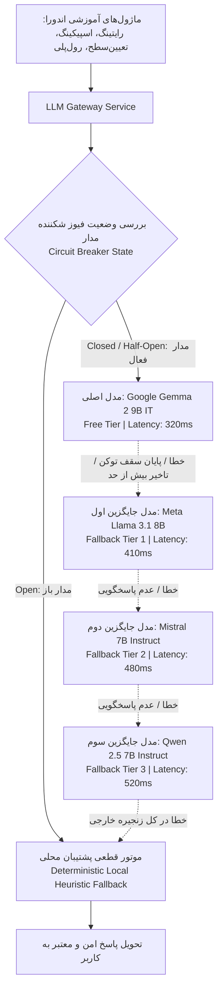
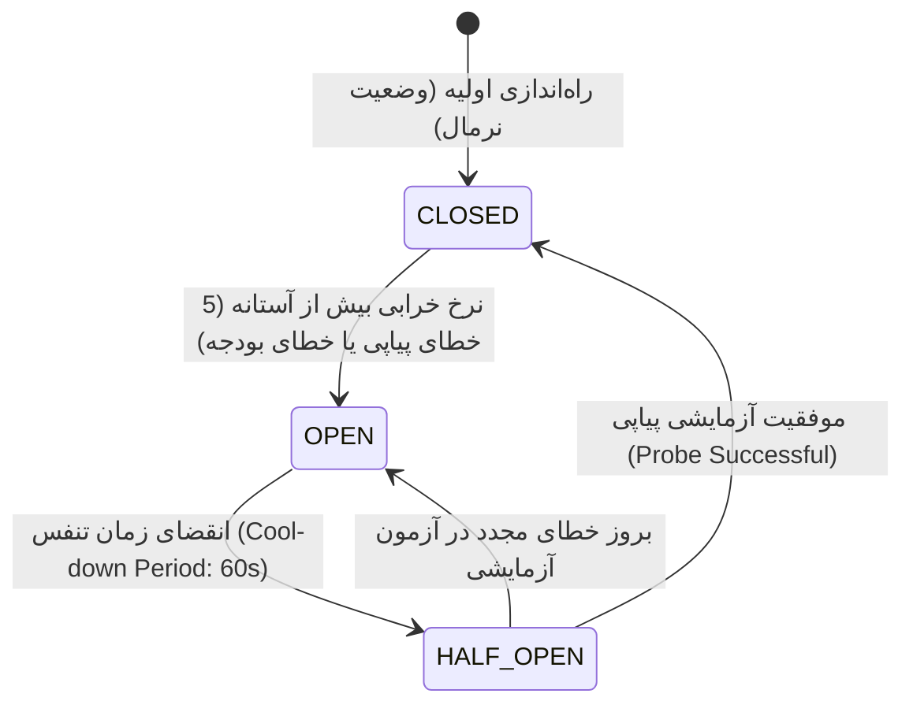

# راهنمای جامع مدیریت عملیات هوش مصنوعی، مسیریابی مدل‌ها و رجیستری پرامپت‌ها (OPS-005)
## AI Model & Prompt Registry Operations, LLM Gateway Telemetry, Token Budgets & Error Budget Management

این سند معماری تفصیلی، پروتکل‌های نظارتی، مکانیسم‌های بازدارنده تاب‌آوری (Circuit Breaker) و رویه‌های مدیریت نسخه‌بندی پرامپت‌های پلتفرم اندورا را بر پایه مشخصات معماری **OPS-005** تبیین می‌نماید.

---

### ۱. معماری دروازه هوش مصنوعی و آبشار تاب‌آوری مدل‌ها (Model Router & Fallback Cascade)

دروازه هوش مصنوعی اندورا (`ai_gateway`) وظیفه دارد تعاملات زیرسیستم‌های هوشمند پلتفرم (آزمون تعیین سطح، ارزیابی نوشتار، تحلیل تلفظ و آزمایشگاه صوت، سناریوهای نقش‌آفرینی زنده و تولید تمارین تطبیقی) را با اطمینان ۹۹.۵٪ و حداقل تاخیر مدیریت نماید.



#### ویژگی‌های کلیدی آبشار مسیریابی:
1. **اولویت مدل اصلی (`google/gemma-2-9b-it:free`)**: بهره‌گیری از توان پردازش زبانی پیشرفته با سقف هزینه صفر در سناریوهای با بار بالا.
2. **زنجیره شکست متوالی (Failover Cascade)**: در صورتی که هر مدل با خطای شبکه، محدودیت نرخ مصرف (Rate Limit 429)، خطای زیرساخت سرویس‌دهنده (5xx) یا تایم‌اوت مواجه شود، درخواست بلافاصله بدون توقف یا اطلاع خطا به کاربر به مدل بعدی منتقل می‌گردد.
3. **موتور قطعی پشتیبان (`Local Mock / Heuristic Engine`)**: در شرایط قطع سراسری اینترنت بین‌الملل یا خرابی درگاه ارائه‌دهنده، پاسخ‌های ارزیابی مبتنی بر منطق تحلیلی داخلی و واژه‌نامه‌های ساختاریافته تولید شده و پایداری ۱۰۰٪ آموزش تضمین می‌شود.

---

### ۲. ماشین حالت قطع‌کننده مدار و بودجه خطا (Circuit Breaker & Error Budget SLA)

برای جلوگیری از ارسال مکرر درخواست به ارائه‌دهندگانی که دچار اختلال شده‌اند و پیشگیری از قفل شدن منابع، سیستم از الگوی فیوز خودکار سه‌حالته استفاده می‌کند:



| مشخصه مدارشکن | مقدار پیکربندی‌شده | توضیح عملیاتی |
| :--- | :--- | :--- |
| **حداکثر خطاهای متوالی مجاز** | ۵ خطا (`failure_threshold = 5`) | پس از ۵ خطای مداوم ارائه‌دهنده، وضعیت بلافاصله به `OPEN` تغییر می‌کند. |
| **دوره زمانی تنفس و آزمون مجدد** | ۶۰ ثانیه (`cool_down = 60s`) | پس از این مدت، مدار به حالت `HALF_OPEN` وارد شده و یک درخواست آزمایشی ارسال می‌کند. |
| **هدف سطح توافق خدمات (SLA)** | ۹۹.۵٪ دسترسی‌پذیری موفق | حداکثر نرخ خطای مجاز در ماه ۰.۵٪ است. |
| **بودجه خطا (Error Budget)** | ۰.۵۰٪ کل ترافیک مجاز | در صورت مصرف بیش از ۷۵٪ بودجه خطا، هشدارهای نظارتی فعال می‌شوند. |

---

### ۳. کاتالوگ رجیستری پرامپت‌های نسخه‌بندی‌شده (Versioned Prompt Registry)

تمامی پرامپت‌های عملیاتی دارای کد شناسه یکتا، شماره نسخه، سقف توکن تخصیصی، و آزمون‌های رگرسیون ساختاریافته هستند:

| شناسه پرامپت | نسخه | نام و کاربرد | سقف توکن | متغیرهای الزامی ورودی | فرمت خروجی تضمین‌شده |
| :--- | :--- | :--- | :--- | :--- | :--- |
| `exercise_gen_v1` | `1.0.0` | تولید تمارین چهارگزینه‌ای و کلوزتست کنکور | ۱,۲۰۰ | `level`, `topic`, `target_count` | JSON آرایه‌ای از سوالات و کلید پاسخ |
| `writing_eval_v1` | `1.0.0` | تصحیح و نمره‌دهی مقالات آیلتس (۴ معیار بند دسکریپتور) | ۲,۰۴۸ | `task_prompt`, `essay_text`, `target_band` | JSON ساختاریافته نمرات ۴ مهارت + بازخورد اصلاحی |
| `roleplay_dialogue_v1` | `1.0.0` | سناریوهای تعاملی مکالمه و شبیه‌سازی نقش‌آفرینی | ۸۰۰ | `scenario_id`, `user_utterance`, `dialogue_history` | JSON شامل پاسخ دستیار، ترغیب به ادامه و نکات گرامری |
| `placement_diagnostic_v1` | `1.0.0` | تحلیل پاسخ‌های تشخیصی آزمون تعیین‌سطح | ۱,۵۰۰ | `learner_responses`, `domain_performance` | JSON شامل برآورد سطح CEFR، نقاط ضعف و مسیر یادگیری |
| `pronunciation_eval_v1` | `1.0.0` | تحلیل آواشناختی تلفظ و خطاهای واجی | ۱,۰۰۰ | `target_phonemes`, `transcript`, `confidence_scores` | JSON شامل درصد انطباق، واج‌های مشکل‌دار و تمرین صوتی |

> [!IMPORTANT]
> **قانون تغییرناپذیری پرامپت‌های عملیاتی**:
> ویرایش مستقیم متن پرامپت‌های فعال در محیط تولید اکیداً ممنوع است. هرگونه بهبود ساختار دستوری یا بهینه‌سازی تمپلیت باید تحت نسخه جدید (مانند `writing_eval_v2`) ثبت و پس از گذراندن حداقل ۱۰۰ آزمون ارزیابی رگرسیون در محیط استیجینگ به عنوان نسخه فعال برگزیده شود.

---

### ۴. سقف‌های مالی، بودجه توکن و مدیریت مصرف ارائه‌دهندگان

به منظور تضمین عدم تحمیل هزینه‌های غیرمنتظره و مدیریت مصرف منابع، سیستم کنترل‌های زیر را اعمال می‌کند:

```
+-----------------------------------------------------------------------------------+
| سقف روزانه مصرف: ۱,۰۰۰,۰۰۰ توکن     | مصرف امروز: ۲۴۸,۵۰۰ توکن (۲۴.۸۵٪)           |
| سقف هزینه ماهانه: ۵۰ دلار           | هزینه امروز: ۱.۸۶ دلار                         |
| باقیمانده اعتبار ارائه‌دهنده: ۹۸.۱۴ دلار | وضعیت انطباق: پایدار و سبز                    |
+-----------------------------------------------------------------------------------+
```

#### سازوکار پیشگیرانه انسداد:
- **در سطح ۸۰٪ بودجه روزانه**: ارسال اعلان هشدار زرد به اپراتور و مدیران سیستم.
- **در سطح ۹۵٪ بودجه روزانه**: تغییر مسیر درخواست‌های غیرحیاتی (مانند تمرین‌های کمکی اختیاری) به موتور محلی و اختصاص سقف باقیمانده به آزمون‌های تعیین‌سطح و تصحیح رایتینگ رسمی.
- **در سطح ۱۰۰٪ بودجه روزانه**: فعال‌سازی خودکار حالت Fallback ایمن برای تمامی سرویس‌ها تا زمان تنظیم مجدد سقف یا ورود به چرخه ۲۴ ساعت بعد.

---

### ۵. ردیابی ساختاریافته و ثبت لاگ‌های تله‌متری (Structured Tracing)

هر درخواست ارسال‌شده به درگاه هوش مصنوعی دارای شناسه ردیابی اختصاصی (`X-Trace-Id`) بوده و فیلدهای زیر را ثبت می‌نماید:

- `trace_id`: شناسه یکتای UUID v4 برای ردیابی سرتاسری درخواست.
- `prompt_id` و `prompt_version`: شناسه و نسخه الگوی پرامپت استفاده شده.
- `model_used`: نام دقیق مدلی که نهایتاً خروجی را تولید کرده است (یا `local_fallback`).
- `latency_ms`: زمان سپری‌شده از لحظه ارسال تا دریافت خروجی معتبر.
- `prompt_tokens`, `completion_tokens`, `cached_tokens`: آمار تفکیکی مصرف توکن.
- `cost_usd`: هزینه برآوردشده بر اساس جدول تعرفه ارائه‌دهنده.
- `status`: نتیجه نهایی (`SUCCESS`, `FALLBACK_USED`, `ERROR`).
- `fallback_reason`: علت ارجاع به مدل بعدی در صورت وقوع نقص.

---

### ۶. فرامین عملیاتی و ابزارهای خط فرمان (Operational CLI Commands)

#### ۱. بررسی وضعیت مصرف بودجه توکن و سلامت درگاه:
```powershell
.venv\Scripts\python.exe manage.py check_ai_budget --settings=endoora_api.settings.dev
```
این فرمان سقف مصرف روزانه، بودجه ماهانه، وضعیت فیوز مدار، و میزان مصرف به ازای هر مدل را بررسی کرده و در صورت نقض آستانه اخطار خروجی خطا بازمی‌گرداند.

#### ۲. اجرای آزمون ارزیابی رگرسیون پرامپت‌ها:
```powershell
.venv\Scripts\python.exe manage.py evaluate_prompts --prompt=writing_eval_v1 --settings=endoora_api.settings.dev
```
یا ارزیابی تمامی پرامپت‌های کاتالوگ با خروجی جی‌سان:
```powershell
.venv\Scripts\python.exe manage.py evaluate_prompts --all --json --settings=endoora_api.settings.dev
```

---

### ۷. کتابچه عملیات و رفع حادثه (Incident Runbook)

#### سناریوی ۱: باز شدن فیوز شکننده مدار (`Circuit Breaker OPEN`)
1. به داشبورد عملیات هوش مصنوعی در مسیر `/operations/ai` مراجعه فرمایید.
2. وضعیت ارائه‌دهنده را در جدول **توپولوژی آبشار مسیریابی** بررسی کنید.
3. در صورت برطرف شدن اختلال ارائه‌دهنده بالادستی، روی دکمه **«بازنشانی فیوز (Reset Circuit Breaker)»** کلیک نمایید یا اندپوینت زیر را با نقش ادمین فراخوانی کنید:
   ```bash
   POST /api/ai/ops/circuit-breaker/reset/
   ```
4. وضعیت مدار بلافاصله به حالت `HALF_OPEN` تغییر یافته و با ارسال یک ترافیک نمونه، درستی عملکرد آن تایید می‌شود.

#### سناریوی ۲: تست سریع و آزمایشگاهی یک پرامپت بدون تغییر در سیستم تولید
1. در داشبورد عملیات هوش مصنوعی، در جدول **کاتالوگ پرامپت‌ها** روی دکمه **«تست و اعتبارسنجی»** پرامپت مورد نظر کلیک فرمایید.
2. متغیرهای نمونه را تکمیل و روی دکمه **«ارسال آزمایشی پرامپت»** کلیک کنید.
3. متریک‌های تاخیر، توکن‌های مصرفی و فرمت خروجی جی‌سان را به صورت بلادرنگ مشاهده و اعتبارسنجی نمایید.

#### سناریوی ۳: بروزرسانی سقف بودجه توکن روزانه ارائه‌دهنده
1. روی دکمه **«تنظیمات بودجه ارائه‌دهنده»** در هدر پنل عملیات کلیک کنید.
2. سقف جدید توکن روزانه و سقف هزینه دلاری ماهانه را وارد و تغییرات را ذخیره فرمایید.
3. تغییرات بلافاصله در سرویس درگاه اعمال شده و در لاگ‌های ممیزی ثبت می‌گردد.
