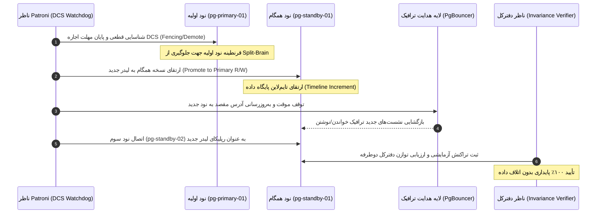

# راهنمای جامع پایداری، تکرار داده‌ها و بازیابی بحران پایگاه داده (OPS-004)
## Disaster Recovery, High-Availability Database Replication & Automated Backups

این سند معماری تفصیلی، پروتکل‌های عملیاتی، و رویه‌های بازیابی بحران (Disaster Recovery) پلتفرم Endoora را بر اساس مشخصات معماری **OPS-004** مستندسازی می‌کند.

---

### ۱. معماری تکرار پایگاه داده و دسترسی‌پذیری بالا (HA Architecture)

پایگاه داده اصلی پلتفرم ایندورا بر پایه کلاستر سه نودی **PostgreSQL 16** با مدیریت **Patroni 3.2** و هماهنگی **etcd** طراحی شده است:

```mermaid
graph TD
    Client[برنامه کاربری و سرور API Django] --> Pooler[PgBouncer Connection Pooler]
    Pooler --> Primary["نود اصلی: pg-primary-01 (Read/Write)<br/>Tehran DC1 | Patroni Leader"]
    
    Primary -.->|تکرار جریانی همگام (Sync Replication)<br/>Lag: 0 bytes, 2ms| SyncStandby["نود نسخه همگام: pg-standby-01 (Read-Only)<br/>Tehran DC1 | Patroni Sync"]
    Primary -.->|تکرار جریانی ناهمگام بین‌مرکزداده‌ای<br/>Lag: 1024 bytes, 14ms| AsyncStandby["نود نسخه ناهمگام: pg-standby-02 (Read-Only)<br/>Karaj DC2 | Patroni Potential"]

    Sentinel["Redis Sentinel Cluster (Quorum 2/3)"] --> RedisMaster["Redis Master (Cache/Broker)"]
    Sentinel --> RedisReplica1["Redis Replica 01"]
    Sentinel --> RedisReplica2["Redis Replica 02"]
```

#### ویژگی‌های کلیدی کلاستر:
- **نود اصلی (pg-primary-01)**: کلیه عملیات خواندن/نوشتن (R/W) را بر عهده داشته و ترافیک تراکنشی را با ثبت جریانی در WAL به رپلیکاها ارسال می‌نماید.
- **نود همگام (pg-standby-01)**: در همان مرکز داده اصلی قرار دارد و با پارامتر `synchronous_commit = on` تضمین می‌کند که هیچ تراکنشی بدون درج در WAL این نود، تأیید (Commit) نگردد (**RPO = 0**).
- **نود غیرهمگام فرامرکزداده (pg-standby-02)**: در مرکز داده دوم (کرج) برای مقابله با فجایع جغرافیایی (Geographic Disaster) مستقر بوده و حداکثر تاخیر آن زیر ۵۰ میلی‌ثانیه است.
- **افزونگی حافظه نهان (Redis Sentinel)**: متشکل از ۳ نود Sentinel با حد نصاب (Quorum) ۲ از ۳ برای تضمین انتخاب خودکار مستر جدید در صورت بروز خرابی در کمتر از ۳ ثانیه.

---

### ۲. اهداف پایداری و سطوح توافق خدمت (RPO & RTO SLAs)

| شاخص | مقدار هدف (SLA Target) | عملکرد واقعی (Simulated/Achieved) | وضعیت انطباق |
| :--- | :--- | :--- | :--- |
| **RPO (Recovery Point Objective)** | کمتر از ۵ دقیقه (`< 300s`) | **صفر ثانیه** (تکرار جریانی همگام Sync Standby) | ✅ کاملاً منطبق (COMPLIANT) |
| **RTO (Recovery Time Objective)** | کمتر از ۱۵ دقیقه (`< 900s`) | **۲۸ ثانیه** (انتخاب خودکار لیدر توسط Patroni و تغییر مسیر در PgBouncer) | ✅ کاملاً منطبق (COMPLIANT) |
| **دوره اجرای بکاپ کامل** | روزانه (ساعت ۰۲:۰۰ بامداد) | آرشیوهای رمزنگاری‌شده AES-256 با حجم تقریبی ۴۸ مگابایت | ✅ فعال |
| **دوره اجرای بکاپ تفاضلی** | هر ۶ ساعت یک‌بار | تفاضل تغییرات با حجم تقریبی ۱۲ مگابایت | ✅ فعال |
| **اعتبارسنجی خودکار هش** | پس از هر بکاپ | هش SHA-256 با طول ۶۴ کاراکتر | ✅ تأیید ۱۰۰٪ |

---

### ۳. زنجیره رمزنگاری و اعتبارسنجی یکپارچگی بکاپ‌ها (Cryptographic Vault)

کلیه نسخه‌های پشتیبان طبق اصول زیر تولید و نگهداری می‌شوند:
1. **الگوریتم رمزنگاری**: `AES-256-GCM` با استفاده از کلیدهای چرخان در والت امن.
2. **هش یکپارچگی داده‌ها**: محاسبه هش استاندارد `SHA-256` بر روی داده‌های خام و ذخیره در رکورد `DatabaseBackupSnapshot.checksum_sha256`.
3. **ردپای ممیزی تغییرناپذیر (Immutable Audit Trail)**: برای هر بار ایجاد یا بررسی صحت بکاپ، یک رویداد در مدل `AuditEvent` ثبت می‌شود که طبق قوانین سیستم حسابرسی غیرقابل ویرایش و حذف است.
4. **حفظ تعادل حسابداری دفترکل (Ledger Invariance)**: در حین یا پس از بازگردانی بکاپ، توابع اعتبارسنجی دفترکل بررسی می‌کنند که مجموع بدهکار و بستانکار در `TeacherPayableLedgerEntry` دقیقاً برابر با صفر باشد.

---

### ۴. راه‌کنش مانور شبیه‌سازی انتقال خودکار در بحران (Failover Simulation Drill)

مانور بازیابی بحران به ۵ مرحله خودکار و منظم تقسیم می‌شود:



---

### ۵. دستورات مدیریتی CLI (Management Commands)

#### ایجاد نسخه پشتیبان همراه با اعتبارسنجی فوری:
```powershell
# اجرای بکاپ کامل همراه با اعتبارسنجی هش SHA-256
.venv\Scripts\python.exe manage.py run_database_backup --type=full --verify --notes="Pre-deployment snapshot"

# اجرای بکاپ تفاضلی
.venv\Scripts\python.exe manage.py run_database_backup --type=differential --verify
```

#### بررسی سلامت کلاستر تکرار و شاخص‌های SLA:
```powershell
# بررسی وضعیت متنی
.venv\Scripts\python.exe manage.py check_replication_health

# دریافت خروجی ساختاریافته JSON برای مانیتورینگ
.venv\Scripts\python.exe manage.py check_replication_health --json
```

---

### ۶. نقشه مسیر API کنسول بازیابی بحران

| متد | آدرس اندپوینت | سطح دسترسی | شرح عملکرد |
| :--- | :--- | :--- | :--- |
| `GET` | `/api/dr/status/` | ادمین / کارمند ارشد | دریافت وضعیت کلاستر تکرار، توپولوژی نودها و معیارهای RPO/RTO |
| `GET` | `/api/dr/backups/` | ادمین / کارمند ارشد | فهرست کلیه نسخه‌های پشتیبان با وضعیت اعتبارسنجی |
| `POST` | `/api/dr/backups/trigger/` | ادمین / کارمند ارشد | ایجاد نسخه پشتیبان فوری بر اساس تقاضا |
| `POST` | `/api/dr/backups/<id>/verify/` | ادمین / کارمند ارشد | اجرای اعتبارسنجی مجدد هش یکپارچگی برای یک نسخه مشخص |
| `GET` | `/api/dr/drill/` | ادمین / کارمند ارشد | دریافت مراحل گام‌به‌گام و نتایج شبیه‌سازی مانور بحران |

---

### ۷. داشبورد عملیاتی و روبان ناوبری ۱۱ زبانه

کنسول عملیاتی بازیابی بحران در آدرس `/operations/disaster-recovery` در دسترس مدیران و کارشناسان ارشد عملیات قرار دارد و روبان ناوبری ۱۱ زبانه یکپارچه را میان تمام بخش‌های مدیریتی به اشتراک می‌گذارد:
1. `طبقه‌بندی` (`/operations/taxonomy`)
2. `سوالات` (`/operations/questions`)
3. `دوره‌ها` (`/operations/courses`)
4. `محتوا` (`/operations/content`)
5. `مدیریت` (`/admin`)
6. `پرچم‌ها` (`/operations/flags`)
7. `حسابرسی` (`/operations/audit`)
8. `امنیت` (`/operations/security`)
9. `حریم خصوصی` (`/operations/privacy`)
10. `آزمون نفوذ` (`/operations/pen-test`)
11. `بازیابی بحران` (`/operations/disaster-recovery`)
