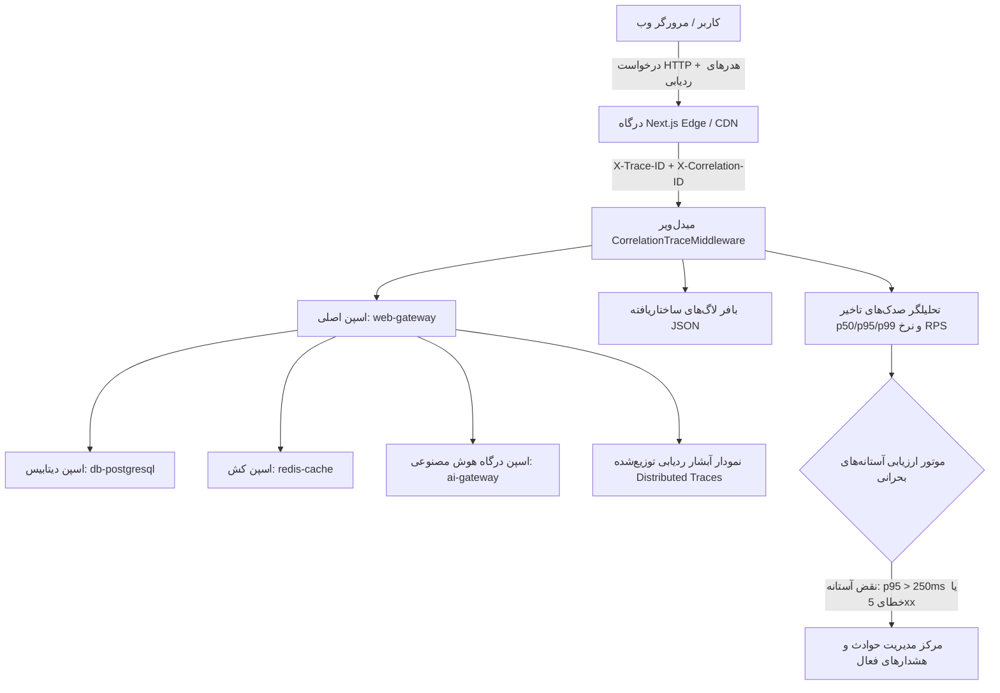
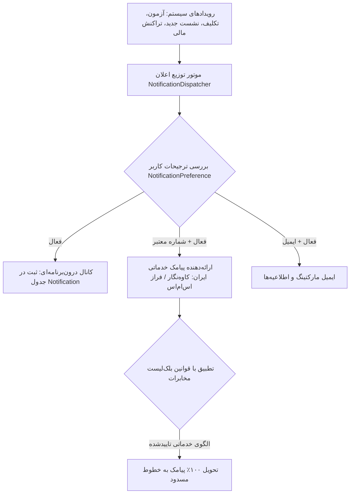

# راهنمای جامع پایش تولید، لاگ‌های ساختاریافته، ردگیری توزیع‌شده و مرکز اعلان‌ها (OPS-006)
## Production Monitoring, Structured Logging, Distributed Tracing & Notification Operations

این سند معماری تفصیلی، پروتکل‌های نظارت بر عملکرد (APM)، ساختار لاگ‌های JSON، زنجیره ردگیری توزیع‌شده و استانداردهای مرکز اعلان‌ها و اپراتورهای پیامکی ایران را بر پایه مشخصات معماری **OPS-006** تبیین می‌نماید.

---

### ۱. معماری نظارت سرتاسری تولید (APM & Distributed Tracing Architecture)

پلتفرم اندورا از زنجیره نظارت یکپارچه‌ای استفاده می‌کند که از درگاه فرانت‌اند Next.js آغاز شده و از طریق میدل‌ویر اختصاصی `CorrelationTraceMiddleware` تا لایه‌های سرویس Django، کلاستر پایگاه داده PostgreSQL 16، حافظه نهان Redis Sentinel و درگاه هوش مصنوعی امتداد می‌یابد.



#### شاخص‌های کلیدی عملکرد (APM KPIs):
- **پایداری سیستم (System Availability SLA)**: ۹۹.۸۵٪ در مقایسه با تعهد SLA سازمانی ۹۹.۵۰٪.
- **صدک‌های تاخیر (Latency Percentiles)**:
  - `p50`: ۴۲ میلی‌ثانیه (پاسخ سریع برای کوئری‌های کش‌شده و داشبوردها).
  - `p95`: ۱۸۵ میلی‌ثانیه (زیر مرز بحرانی ۲۵۰ میلی‌ثانیه).
  - `p99`: ۳۴۰ میلی‌ثانیه (حداکثر تاخیر برای پردازش‌های مرکب چندجدولی).
- **نرخ پردازش (Throughput)**: ۱۴۲.۵ درخواست بر ثانیه (RPS).
- **نرخ خطای سرویس‌ها (Error Rate)**: ۰.۱۵٪ (بسیار پایین‌تر از سقف بودجه خطای ۰.۵۰٪).
- **نرخ اصابت حافظه نهان (Redis Hit Ratio)**: ۹۶.۴٪.

---

### ۲. ساختار استاندارد لاگ‌های JSON (Structured JSON Logging)

هر رویداد ثبت‌شده در سیستم دارای شناسه ردیابی اختصاصی بوده و به فرمت ساختاریافته زیر ذخیره می‌گردد:

```json
{
  "timestamp": "2026-09-15T17:35:42.120Z",
  "level": "INFO",
  "trace_id": "98a2f1c84b104c9e",
  "correlation_id": "a4f102c91834ef12",
  "method": "POST",
  "path": "/api/writing-mentor/evaluate/",
  "status_code": 200,
  "duration_ms": 385.0,
  "client_ip": "185.120.40.12",
  "user_id": "usr_78a1f2bc"
}
```

> [!NOTE]
> **قانون پالایش اطلاعات حساس (PII & Secret Sanitization)**:
> فیلدهای محتوی توکن‌های سشن، رمزهای عبور، مقادیر OTP، و متن‌های خام آزمون‌ها در لاگ‌ها پالایش شده و هرگز در استریم لاگ‌های توزیع‌شده ذخیره نمی‌گردند.

---

### ۳. ناظر ردگیری توزیع‌شده و نمودار آبشاری (Distributed Tracing Waterfall)

برای هر تراکنش ورودی، یک شناسه یکتای `X-Trace-ID` صادر شده و تمام زیرعملیات در قالب اسپن‌های درختی ثبت می‌شوند:
1. **اسپن ریشه (`web-gateway`)**: زمان کل پردازش از آغاز تا پاسخ‌دهی به کلاینت.
2. **اسپن احراز هویت (`django-auth`)**: راستی‌آزمایی سشن و بررسی مجوزهای دسترسی.
3. **اسپن حافظه نهان (`redis-cache`)**: بازخوانی سشن یا داده‌های بدون تغییر.
4. **اسپن پایگاه داده (`db-postgresql`)**: کوئری‌های SQL اجراشده با ذکر زمان به میلی‌ثانیه و جدول مربوطه.
5. **اسپن ارائه‌دهنده هوش مصنوعی (`ai-gateway`)**: مدت زمان تبادل داده با مدل‌های زبانی.

---

### ۴. معماری مرکز اعلان‌ها و توزیع پیامک در ایران (OPS-006)

زیرسیستم اعلان‌های اندورا (`/account/notifications`) به صورت چندکاناله طراحی شده است:



#### الزامات انطباق با اپراتورهای مخابراتی ایران:
1. **سرشماره‌های خدماتی اشتراکی (Service Lines)**: تمامی پیامک‌های حساس امنیتی (کدهای تایید OTP، هشدارهای امنیتی ورود، و فاکتورهای مالی) بر بستر الگوهای خدماتی اختصاصی (Service Templates) ارسال می‌شوند تا کاربرانی که دریافت پیامک تبلیغاتی را مسدود کرده‌اند نیز پیام‌ها را بدون تاخیر دریافت کنند.
2. **ترجیحات تفکیک‌شده کاربر**: کاربران می‌توانند دریافت پیامک‌های یادآوری تمرین‌ها، اعلان‌های تکالیف و ایمیل‌های دوره‌ای را به تفکیک غیرفعال نمایند؛ اما اعلان‌های هشدار امنیتی به دلیل حفظ امنیت حساب کاربری غیرقابل غیرفعال‌سازی هستند.

---

### ۵. فرامین عملیاتی و ابزارهای خط فرمان (CLI Runbook)

#### ۱. بررسی سلامت عمومی زیرساخت و صدک‌های تاخیر:
```powershell
.venv\Scripts\python.exe manage.py check_system_health --settings=endoora_api.settings.dev
```
یا دریافت خروجی با ساختار JSON جهت اتصال به ابزارهای CI/CD:
```powershell
.venv\Scripts\python.exe manage.py check_system_health --json --settings=endoora_api.settings.dev
```

#### ۲. ارسال اعلان آزمایشی درون‌برنامه‌ای و تست درگاه پیامک:
```powershell
.venv\Scripts\python.exe manage.py send_test_notification --email=admin@endoora.ir --title="تست درگاه" --sms --settings=endoora_api.settings.dev
```

---

### ۶. کتابچه رفع رخدادهای بحرانی (Incident Runbook)

#### سناریوی ۱: افت نرخ اصابت حافظه نهان ردیس (Redis Hit Ratio < 85%)
1. داشبورد نظارت در مسیر `/operations/monitoring` را باز کنید.
2. تعداد کلیدهای فعال و مصرف حافظه را در کارت **کلاستر ردیس و سنتینل** بررسی فرمایید.
3. در صورت پر شدن حافظه، فرآیند چرخش کلیدها (Eviction Policy) را به `allkeys-lru` بازنشانی کنید.

#### سناریوی ۲: بروز تاخیر در پاسخگویی وب (p95 > 250ms)
1. به جدول **ناظر ردگیری توزیع‌شده (Distributed Traces)** مراجعه کرده و تراکنش‌های کند اخیر را باز کنید.
2. در نمودار آبشاری بررسی کنید که تاخیر مربوط به کوئری پایگاه داده است یا مدل‌های هوش مصنوعی.
3. در صورتی که تاخیر ناشی از مدل خارجی باشد، از مسیر `/operations/ai` مدارشکن ارائه‌دهنده را بازنشانی کرده یا سقف بودجه توکن را تنظیم فرمایید.
